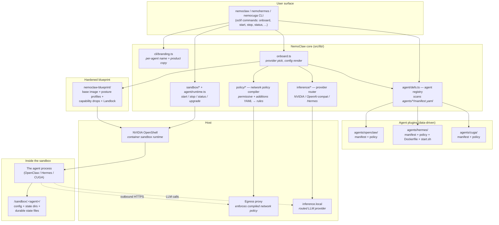

<!--
  SPDX-FileCopyrightText: Copyright (c) 2026 NVIDIA CORPORATION & AFFILIATES. All rights reserved.
  SPDX-License-Identifier: Apache-2.0
-->

# Existing NemoClaw Architecture

This is a working-developer view of NemoClaw as of this branch — enough to understand where a new agent plugs in. The authoritative reference is the upstream [Architecture Details](https://docs.nvidia.com/nemoclaw/latest/reference/architecture.html) page.

## Architecture — building blocks



**Reading it:** the CLI is one entrypoint with three launcher names. The agent registry is purely data-driven — it scans `agents/*/manifest.yaml`, so adding an agent is a file drop, not a code change. The blueprint + OpenShell form the sandbox boundary; the network policy compiler turns declarative YAML into rules enforced by the egress proxy. Inside the sandbox, the agent only sees its config dir and routed inference.

## What NemoClaw enables

| Capability | What you can do because of it |
|------------|-------------------------------|
| **Pluggable agents** | Add a new agent by dropping `agents/<name>/manifest.yaml` — no core code changes needed |
| **Hardened sandbox by default** | Run any always-on agent with capability drops, process limits, posture profiles, Landlock — without writing container security yourself |
| **Routed + audited inference** | Point any agent's LLM calls at one inference router instead of letting it talk to N providers directly; failover, provider keys, audit logs in one place |
| **Declarative egress policy** | Allowlist outbound hosts/ports/protocols per agent (and per shields-up/shields-down mode), enforced by an egress proxy, not trust |
| **One-CLI lifecycle** | `onboard`, `start`, `stop`, `status`, `upgrade`, `uninstall` — same shape across every agent |
| **Per-agent branding** | A user who installs via `nemohermes` keeps seeing `nemohermes` in every help/usage string; same for `nemocuga` |
| **State management** | Manifest declares state dirs and durable files (with `sqlite_backup` strategy) so rebuilds preserve pairing, plans, knowledge indexes |
| **Sandbox/host port forwarding + health probes** | UI/API ports surfaced to the host with readiness checks defined per agent |
| **Messaging adapter catalog** | Per-agent declared messaging platforms (Telegram, Discord, Slack, WeChat, WhatsApp) — uniform configuration across agents that support them |
| **Device pairing or bearer auth** | Manifest declares the auth model; CLI flows adapt accordingly |

## Capabilities

NemoClaw is a CLI + reference stack that:

- **Onboards** a chosen agent into an OpenShell sandbox (`nemoclaw onboard`)
- **Manages lifecycle** — start, stop, status, restart, upgrade, uninstall
- **Routes inference** through providers configured per-agent (NVIDIA, OpenAI-compatible custom endpoints, Hermes Provider, etc.)
- **Enforces network egress** through declarative policy YAML, with permissive ("shields down") and additive variants
- **Provisions sandbox state** — config dir, state dirs, durable state files (SQLite backup support)
- **Forwards UI/API ports** from sandbox to host, with health probes
- **Brands itself** per agent (binary name, display name, product copy)

## Repository shape

```
NemoClaw/
├── bin/                          # Node CLI entrypoints (one per alias)
│   ├── nemoclaw.js
│   └── nemohermes.js             # sets NEMOCLAW_AGENT=hermes, then requires the main CLI
├── agents/                       # Per-agent definitions — auto-discovered
│   ├── openclaw/
│   │   ├── manifest.yaml         # The contract
│   │   └── policy-permissive.yaml
│   └── hermes/
│       ├── manifest.yaml
│       ├── policy-additions.yaml
│       ├── policy-permissive.yaml
│       ├── Dockerfile / Dockerfile.base
│       ├── start.sh
│       ├── generate-config.ts
│       ├── plugin/               # Python plugin for the agent
│       ├── config/               # TS helpers that write agent config
│       └── host/                 # Host-side helpers
├── nemoclaw-blueprint/           # The hardened OpenShell container blueprint
├── schemas/                      # JSON Schemas: blueprint, onboard-config, openclaw-plugin, policy-preset, router-pool, sandbox-policy
├── src/
│   ├── nemoclaw.ts               # Main CLI bootstrap (oclif)
│   ├── commands/                 # oclif commands (onboard, start, stop, status, sandbox/*, inference/*, …)
│   └── lib/
│       ├── agent/                # Agent registry — the integration surface
│       │   ├── defs.ts           # Manifest loader: listAgents, loadAgent, getAgentChoices, resolveAgentName
│       │   ├── runtime.ts
│       │   ├── onboard.ts
│       │   ├── base-image.ts
│       │   └── dashboard-ui.ts
│       ├── cli/branding.ts       # Per-agent CLI/display/product naming
│       ├── onboard.ts            # Onboarding orchestration
│       ├── inference/            # Provider router
│       ├── policy/               # Network policy compiler
│       └── sandbox/              # Sandbox lifecycle
├── test/                         # Vitest integration tests
└── docs/                         # Fern-rendered docs (published at docs.nvidia.com/nemoclaw)
```

## The agent plugin contract

Adding an agent is **data-driven**: drop a directory under `agents/<name>/` with a `manifest.yaml`, and `src/lib/agent/defs.ts` auto-discovers it.

`listAgents()` scans `agents/*/manifest.yaml`. `loadAgent(name)` parses the manifest into an `AgentDefinition` with typed accessors. `getAgentChoices()` powers the interactive picker. `resolveAgentName()` resolves the active agent from (priority): explicit `--agent` flag → `NEMOCLAW_AGENT` env → session state → default `openclaw`.

A manifest declares, among other things:

| Field | Purpose |
|-------|---------|
| `name`, `display_name`, `description` | Identity and picker copy |
| `language`, `install_method`, `binary_path`, `version_command`, `expected_version`, `gateway_command` | How NemoClaw installs and launches the agent |
| `health_probe.{url,port,timeout_seconds}` | Readiness check |
| `forward_ports` | Ports forwarded from sandbox to host |
| `dashboard.{kind,label,path}` and optional `dashboard_ui` | UI / API surface and a separate optional web dashboard |
| `config.{dir,config_file,env_file,format}` | Where the agent's config lives inside the sandbox |
| `state_dirs`, `state_files[].strategy` | What to persist across rebuilds (`copy` or `sqlite_backup`) |
| `device_pairing`, `web_auth_method`, `web_auth_env` | Auth model |
| `messaging_platforms.supported` | Which built-in messaging adapters apply |
| `inference.{provider_type,provider_options,...}` | How the agent talks to LLMs |
| `phone_home_hosts`, `package_registry.hosts` | Egress allowlist seeds |

A sibling `policy-permissive.yaml` (and optional `policy-additions.yaml`) declares network policy: filesystem (read-only and read-write paths), Landlock compatibility, process user, and a map of `network_policies` with hosts/ports/protocols/enforcement.

## Lifecycle (in one paragraph)

`nemoclaw onboard` reads the manifest, picks/validates an inference provider, builds the hardened blueprint with the agent's Dockerfile layered on top, provisions the sandbox config and state, applies the network policy, and registers the sandbox. `start`/`stop`/`status` interact with OpenShell. The CLI's binary name (`nemoclaw` vs `nemohermes`) flows from `NEMOCLAW_INVOKED_AS`, so user-facing copy reflects whichever launcher the user typed.

## Flow diagram — from `nemocuga onboard` to a running agent

```mermaid
sequenceDiagram
    autonumber
    actor U as User
    participant BIN as bin/nemocuga.js
    participant CLI as oclif CLI (src/nemoclaw.ts)
    participant BR as branding.ts
    participant REG as agent/defs.ts
    participant ONB as onboard.ts
    participant INF as inference router
    participant POL as policy compiler
    participant BLU as blueprint builder
    participant OS as OpenShell
    participant SBX as Sandbox container
    participant AG as Agent process

    U->>BIN: nemocuga onboard
    BIN->>BIN: set NEMOCLAW_AGENT=cuga<br/>set NEMOCLAW_INVOKED_AS=nemocuga
    BIN->>CLI: require('../dist/nemoclaw')
    CLI->>BR: resolve branding (cuga → "CUGA"/"NemoCuga")
    CLI->>REG: resolveAgentName() + loadAgent("cuga")
    REG->>REG: parse agents/cuga/manifest.yaml
    REG-->>CLI: AgentDefinition
    CLI->>ONB: run onboard flow
    ONB->>INF: pick + validate provider<br/>(custom OpenAI-compat base URL)
    ONB->>POL: compile agents/cuga/policy-permissive.yaml<br/>+ phone_home_hosts + package_registry
    ONB->>BLU: build hardened image (base + agent Dockerfile)
    BLU-->>ONB: image ref
    ONB->>OS: provision sandbox<br/>(image, config dir, state dirs, ports, policy)
    OS-->>ONB: sandbox registered
    ONB-->>U: "Onboarding complete"

    U->>BIN: nemocuga start
    BIN->>CLI: ...
    CLI->>OS: start sandbox
    OS->>SBX: launch container with policy + caps
    SBX->>AG: gateway_command (cuga server start)
    AG->>AG: bind :8005, expose /health + UI
    loop until ready or timeout
      CLI->>SBX: health probe (http://localhost:8005/health)
      SBX-->>CLI: 200 OK
    end
    CLI-->>U: forwarded URL: http://localhost:8005/

    Note over AG,OS: At runtime, every outbound HTTPS goes<br/>through the egress proxy which enforces<br/>the compiled network policy; LLM calls<br/>go through inference.local.
```

**Reading it:** steps 1–3 show how the alias launcher pre-selects the agent before the CLI starts. Steps 4–6 are the data-driven part — branding and registry both look up "cuga" with no agent-specific code paths. Steps 7–12 are the onboarding chain that turns the manifest + policy into an actual sandbox. Steps 13–18 are the start path with the per-agent health probe. The final note is the runtime invariant the whole stack exists to enforce.

## Branding registry

`src/lib/cli/branding.ts` holds a per-agent branding record (display name, product name, uninstall goodbye line) and an allowlist of known CLI launcher names. Any new bin launcher must be added to that allowlist for help/usage strings to show the right name.

This is the second integration point — beyond `agents/<name>/manifest.yaml` — that a new agent needs to touch.
